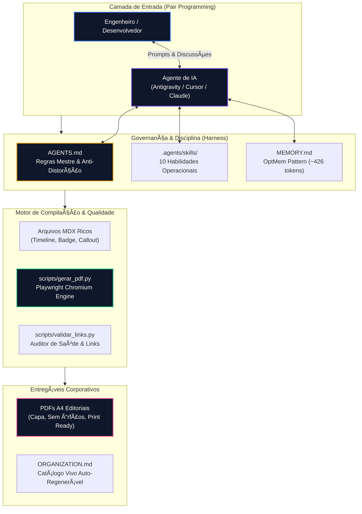

# 🧠 Agentic Knowledge OS

> **The Professional AI-Augmented Second Brain & Knowledge Operating System.**  
> Built for autonomous pair programming with **Google Antigravity**, **Cursor**, and **Claude Code**, powered by an editorial A4 PDF publishing engine and 10 production-grade Agent Skills.

---

<p align="center">
  
  
  
  
  
  
</p>

---

## 🌟 O que é o Agentic Knowledge OS?

A maioria dos "Second Brains" em Markdown sofre de três problemas graves quando utilizados com agentes de IA:
1. **Proliferação de Arquivos Duplicados**: Agentes criam um arquivo novo a cada prompt, fragmentando o conhecimento.
2. **Diagramas Quebrados & Ilegíveis**: Modelos geram árvores horizontais gigantes que ficam ilegíveis ou quebram páginas ao exportar para PDF.
3. **Falta de Rigor de Engenharia**: Falta de rastreabilidade de tarefas, ausência de testes e alucinações sobre escopo.

O **Agentic Knowledge OS** resolve isso fornecendo um **Harness de Engenharia Completo**:
- 📐 **Diretrizes Mestre Anti-Alucinação (`AGENTS.md`)**: Regras inquebráveis de proporção de diagramas Mermaid, estilo profissional, preservação histórica de relatórios e blocos de código cirúrgicos (< 10 linhas).
- 📑 **Motor de PDF Editorial A4 (`scripts/gerar_pdf.py`)**: Converte arquivos `.mdx` em PDFs corporativos com capa executiva, rodapés dinâmicos, paginação CSS Paged Media e algoritmos que eliminam quebras órfãs (`anti-orphan page break`).
- 🧩 **Design System MDX**: Componentes React reutilizáveis (`<Timeline />`, `<Badge />`, `<Callout />`, `<LinkCard />`, `<ClickUpCard />`).
- 🧠 **Memória Contínua Ultraleve (OptMem Pattern)**: Persistência episódica de longo prazo em ~426 tokens sem overhead de bancos vetoriais.
- 🧰 **Hub de 10 Agent Skills**: Extensões operacionais modulares em `.agents/skills/` (TDD, auditoria de Design Systems, crawling Apify, banco de dados DBX MCP).

---

## 🏛️ Arquitetura do Sistema


```mermaid
flowchart TD
    subgraph INPUT["Camada de Entrada (Pair Programming)"]
        A["Engenheiro / Desenvolvedor"] <-->|"Prompts & Discussões"| B["Agente de IA<br/>(Antigravity / Cursor / Claude)"]
    end

    subgraph HARNESS["Governança & Disciplina (Harness)"]
        B <--> C["AGENTS.md<br/>Regras Mestre & Anti-Distorção"]
        B <--> D[".agents/skills/<br/>10 Habilidades Operacionais"]
        B <--> M["MEMORY.md<br/>OptMem Pattern (~426 tokens)"]
    end

    subgraph ENGINE["Motor de Compilação & Qualidade"]
        E["Arquivos MDX Ricos<br/>(Timeline, Badge, Callout)"]
        F["scripts/gerar_pdf.py<br/>Playwright Chromium Engine"]
        G["scripts/validar_links.py<br/>Auditor de Saúde & Links"]
    end

    subgraph OUTPUT["Entregáveis Corporativos"]
        H["PDFs A4 Editoriais<br/>(Capa, Sem Órfãos, Print Ready)"]
        I["ORGANIZATION.md<br/>Catálogo Vivo Auto-Regenerável"]
    end

    INPUT --> HARNESS
    HARNESS --> ENGINE
    ENGINE --> OUTPUT

    style A fill:#0f172a,stroke:#3b82f6,stroke-width:2px,color:#fff
    style B fill:#0f172a,stroke:#8b5cf6,stroke-width:2px,color:#fff
    style C fill:#0f172a,stroke:#f59e0b,stroke-width:2px,color:#fff
    style F fill:#0f172a,stroke:#10b981,stroke-width:2px,color:#fff
    style H fill:#0f172a,stroke:#ec4899,stroke-width:2px,color:#fff
```

---

## 🚀 Início Rápido (Quickstart)

### 1. Clonar o Repositório
```bash
git clone https://github.com/SEU_USUARIO/agentic-knowledge-os.git
cd agentic-knowledge-os
```

### 2. Rodar a Inicialização Automática
```bash
python scripts/setup.py
```
*O script verificará o ambiente, instalará as dependências (`Playwright Chromium`, `requirements.txt`) e personalizará o seu `AGENTS.md`.*

### 3. Compilar seu Primeiro PDF Editorial
```bash
python scripts/gerar_pdf.py exemplos/01-ata-reuniao-arquitetura.mdx
```
*O PDF será compilado em segundos dentro de `exemplos/pdf/` com alta fidelidade visual A4.*

---

## 📋 Comandos do Repositório (CLI)

| Comando | Descrição |
| :--- | :--- |
| `python scripts/gerar_pdf.py <arquivo.mdx>` | Compila um arquivo `.mdx` individual em PDF corporativo. |
| `python scripts/gerar_pdf.py --dir <pasta>` | Compila em lote todos os arquivos `.mdx` de uma pasta. |
| `python scripts/gerar_pdf.py <arquivo.mdx> --check-only` | Linter rápido: valida regras de diagramas, moedas e quebras sem renderizar. |
| `python scripts/validar_frontmatter.py` | Garante que todas as notas possuem metadados válidos. |
| `python scripts/validar_links.py` | Detecta links quebrados ou hiperlinks órfãos em todo o repositório. |
| `python scripts/gerar_organization.py` | Atualiza a matriz de categorias e links rápidos do `ORGANIZATION.md`. |

---

## 🧩 Componentes Visuais MDX Inclusos

O motor renderiza nativamente componentes modernos direto no PDF e no navegador:
- `<Timeline items={[...]} />`: Linha do tempo visual com datas, badges de status e conectores verticais.
- `<Callout title="..." type="info|warning|success|danger">`: Cards informativos corporativos.
- `<Badge label="..." type="trabalho|projeto|ideia" />`: Tags coloridas semânticas.
- `<LinkCard title="..." href="..." />`: Cards de navegação entre documentos.
- Diagramas **Mermaid.js** com renderização SVG em alta resolução (300 DPI) e proteção anti-distorção tipográfica.

---

## 🛠️ Hub de 10 Agent Skills Homologadas

Localizadas em `.agents/skills/`, prontas para agentes autônomos invocarem sob demanda:
1. `pdf-generator`: Validação e compilação de documentos MDX em PDFs A4.
2. `second-brain-doctor`: Auditoria de saúde, validação de frontmatter e auto-catálogo.
3. `anti-rationalization`: Portões de disciplina e tabelas anti-racionalização para IAs.
4. `meeting-to-knowledge`: Transformação de gravações e atas brutas em documentos executivos.
5. `clickup-task-flow`: Orquestração de tarefas, escopo imutável e dossiês de homologação.
6. `optmem-pattern`: Padrão de memória episódica persistente ultracompacta (~426 tokens).
7. `designsys-audit`: Extração de design tokens W3C e auditoria de CSS via `designsys`.
8. `playwright-cli`: Navegação headless e testes E2E com alta economia de tokens.
9. `dbx-mcp`: Conexão universal com 100+ bancos de dados via Model Context Protocol.
10. `hyperframes`: Produção de vídeos programáticos determinísticos em HTML/CSS/GSAP.

---

## 🔒 Como Usar para Seu Portfólio & Manter Anotações Privadas

Este repositório foi arquitetado especificamente para permitir que você:
1. Mantenha **este repositório público no GitHub** como uma vitrine do seu nível de maturidade em Engenharia de Software, Agentes de IA e Automação de Documentação.
2. Mantenha seu **repositório pessoal de anotações privado**, configurando este repositório público como `upstream`:
   ```bash
   git remote add upstream https://github.com/SEU_USUARIO/agentic-knowledge-os.git
   ```
   Toda melhoria de motor de PDF ou nova skill que você criar pode ser sincronizada entre ambos via git sem vazar nenhum dado de cliente!

---

## 📄 Licença

Distribuído sob a licença **MIT**. Sinta-se livre para utilizar, customizar e estender para seus próprios projetos e clientes.
