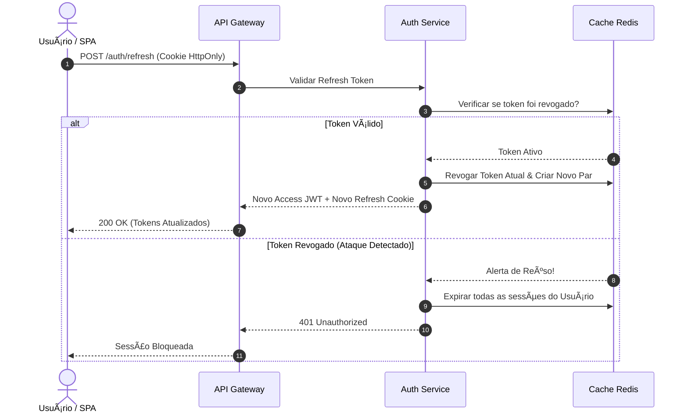

import { Timeline } from "../components/Timeline.jsx";
import { Badge } from "../components/Badge.jsx";
import { Callout } from "../components/Callout.jsx";
import { LinkCard } from "../components/LinkCard.jsx";

# [TASK-001] Implementação de Autenticação Segura JWT com Refresh Token e Rotação

<Badge label="Módulo Segurança" type="trabalho" />
<Badge label="Status: Concluído" type="projeto" />
<Badge label="Prioridade: Alta" type="ideia" />

## Visão Geral & Contexto

Esta tarefa visa substituir o modelo anterior de autenticação baseada em sessão por um mecanismo robusto e escalável de **Access Tokens JWT (vida curta de 15 min)** e **Refresh Tokens opacos rotativos (vida de 7 dias)**, armazenados em cookies HTTP-Only com proteção contra CSRF e XSS.

- **Responsável**: Engenheiro de Software
- **Complexidade**: Média (Segurança Crítica)
- **Status de Homologação**: 100% dos testes unitários e de integração aprovados.

---

## 1. Parecer Técnico & Análise de Segurança

<Callout title="Padrão OWASP Implementado" type="info">
  Adotamos a rotação obrigatória de refresh token: cada requisição de renovação invalida o refresh token anterior. Caso um token revogado seja reutilizado, todas as sessões do usuário são imediatamente invalidadas por suspeita de comprometimento.
</Callout>

### 1.1 Diagrama de Sequência da Rotação

```mermaid
sequenceDiagram
    autonumber
    actor U as Usuário / SPA
    participant G as API Gateway
    participant A as Auth Service
    participant R as Cache Redis

    U->>G: POST /auth/refresh (Cookie HttpOnly)
    G->>A: Validar Refresh Token
    A->>R: Verificar se token foi revogado?
    alt Token Válido
        R-->>A: Token Ativo
        A->>R: Revogar Token Atual & Criar Novo Par
        A-->>G: Novo Access JWT + Novo Refresh Cookie
        G-->>U: 200 OK (Tokens Atualizados)
    else Token Revogado (Ataque Detectado)
        R-->>A: Alerta de Reúso!
        A->>R: Expirar todas as sessões do Usuário
        A-->>G: 401 Unauthorized
        G-->>U: Sessão Bloqueada
    end
```

---

## 2. Escopo Inicial (Imutável)

- [x] Criação de schema de dados para controle de tokens revogados.
- [x] Middleware de extração e validação de claims JWT via chave pública assimétrica (RS256).
- [x] Endpoints `/auth/login`, `/auth/refresh` e `/auth/logout`.
- [x] Testes automatizados cobrindo cenários de ataque de repetição (Replay Attack).

---

## 3. Linha do Tempo de Execução

<Timeline
  items={[
    {
      date: "2026-10-14",
      title: "Deploy em Produção & Testes de Carga",
      content: "Validação com 2.000 requisições concorrentes sem falhas de concorrência no Redis.",
      status: "Produção",
    },
    {
      date: "2026-10-12",
      title: "Auditoria DevSecOps",
      content: "Varredura SAST/DAST concluída sem apontamento de vulnerabilidades críticas.",
      status: "Homologado",
    },
    {
      date: "2026-10-10",
      title: "Início do Desenvolvimento",
      content: "Definição dos contratos de API e escrita da suíte de testes TDD.",
      status: "Iniciado",
    },
  ]}
/>

---

## Assuntos Relacionados

- [`01-ata-reuniao-arquitetura.mdx`](01-ata-reuniao-arquitetura.mdx) — Ata de arquitetura que homologou a migração de autenticação.
